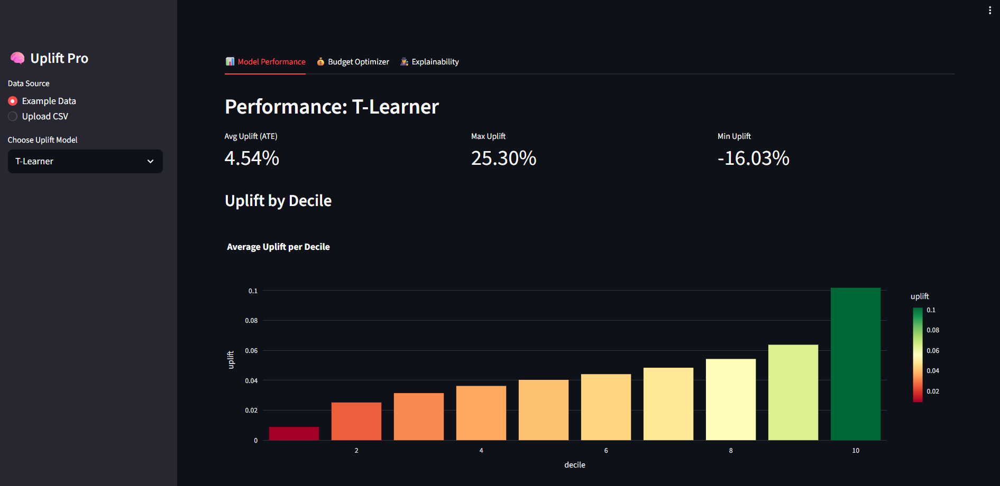

# Causal Uplift Optimizer 🎯




**A production-ready Causal Inference dashboard to identify "Persuadable" customers and maximize marketing ROI.**

Unlike traditional churn or response models that predict *outcomes* (User will buy), Uplift Modeling predicts the *cause-and-effect* of your intervention (Buying *because* of the email).

---

## 📚 Table of Contents
- [Why Uplift Modeling?](#-why-uplift-modeling)
- [Key Features](#-key-features)
- [Tech Stack](#-tech-stack)
- [Installation & Usage](#-installation--usage)
- [Project Structure](#-project-structure)
- [Methodology](#-methodology)
- [License](#-license)

---

## 🧠 Why Uplift Modeling?

In marketing, customers fall into four categories. Standard models (Response models) target everyone who buys, wasting money on "Sure Things" and possibly irritating "Sleeping Dogs".

| Segment | Behavior | Action |
| :--- | :--- | :--- |
| **Persuadables** (✅ Target) | Buy **ONLY IF** treated | **Upsell here! High ROI.** |
| **Sure Things** (❌ Waste) | Buy **REGARDLESS** of treatment | **Do not disturb.** Save budget. |
| **Lost Causes** (❌ Waste) | Never buy | **Do not disturb.** |
| **Sleeping Dogs** (⚠️ Danger) | **Leave** if treated | **Do not disturb.** Negative ROI. |

**This tool specifically identifies the "Persuadables".**

---

## 🌟 Key Features

*   **State-of-the-Art Meta-Learners**:
    *   **T-Learner**: Two independent estimators (Treatment vs Control).
    *   **S-Learner**: Single estimator with treatment as a feature.
    *   **X-Learner**: Advanced two-stage estimator optimized for unbalanced treatment groups.
*   **Budget Optimization Engine**: Interactive constrained optimization to maximize Net Value relative to marketing costs.
*   **Explainable AI (XAI)**: Integrated **SHAP** values to reveal *why* specific users respond positively to interventions.
*   **Performance Metrics**: Cumulative Gain (AUUC) and Uplift-by-Decile visualizations.

---

## 🛠 Tech Stack

*   **Core**: Python 3.11+
*   **Interface**: [Streamlit](https://streamlit.io/)
*   **ML Engine**: [XGBoost](https://github.com/dmlc/xgboost) (Gradient Boosting)
*   **Validation**: Pytest (35+ unit tests)
*   **Packaging**: `uv` (Fast Python package installer)

---

## 🚀 Installation & Usage

### Option 1: Using `uv` (Recommended)
This project is optimized for [uv](https://github.com/astral-sh/uv), the extremely fast Python package manager.

```bash
# 1. Clone the repo
git clone https://github.com/Ismail-Dagli/causal-uplift-optimizer.git
cd causal-uplift-optimizer

# 2. Run immediately (uv handles venv creation and dependencies)
uv run streamlit run app.py
```

### Option 2: Standard Pip
```bash
python -m venv .venv
source .venv/bin/activate  # Windows: .venv\Scripts\activate
pip install -r requirements.txt
streamlit run app.py
```

### Option 3: Docker
```bash
docker build -t causal-uplift .
docker run -p 8501:8501 causal-uplift
```

---

## 📂 Project Structure

```plaintext
causal-uplift-optimizer/
├── app.py                  # Streamlit Entry Point
├── pyproject.toml          # Dependency & Tool Config
├── src/                    # Core Logic Package
│   ├── data_loader.py      # Vectorized Data Processing
│   ├── model.py            # T/S/X Learners & SHAP
│   └── optimizer.py        # ROI Optimization Algorithm
└── tests/                  # Unit Test Suite
    └── test_logic.py
```

## 📊 Dataset

The app works with the **Kevin Hillstrom Email Marketing Dataset**:
*   **Outcome**: Spend / Visit
*   **Treatment**: Men's E-Mail / Women's E-Mail / No E-Mail

*Note: The app automatically downloads the dataset if internet is available, or generates a synthetic causal dataset for offline demo purposes.*

---

## 📄 License

This project is licensed under the **MIT License** - see the LICENSE file for details.
